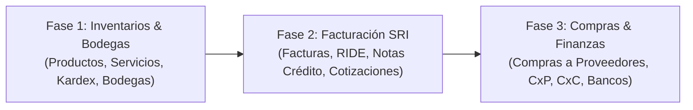

# Especificación de Diseño: Módulos ERP Integrados (Inventarios, Facturación SRI y Compras)

**Proyecto:** INNTEL CORP ERP  
**Fecha:** 26 de Septiembre de 2026  
**Estado:** Propuesta de Diseño Técnico  
**Referencia Base:** Proyecto Hermano `proyectos-webfix` (`E:\CLOUD WEBFIX\WEBFIX\SISTEMAS\PROYECTOS WEBFIX\proyectos-webfix`)  

---

## 1. Visión General y Objetivos

INNTEL CORP requiere la incorporación de los módulos troncales de gestión empresarial presentes en el sistema `proyectos-webfix`:
1. **Control de Inventarios & Bodegas**: Catálogo de productos/equipos físicos (ONTs, routers, bobinas de fibra, splitters, etc.), catálogo de servicios, categorías, marcas, kardex con costeo ponderado, transferencias inter-bodegas y ajustes de inventario.
2. **Facturación & Emisión Electrónica SRI**: Ventas, emisión y autorización de comprobantes electrónicos bajo ficha técnica SRI Ecuador (Facturas, Cotizaciones, Notas de Crédito, Retenciones, Guías de Remisión, Descuentos), clave de acceso de 49 dígitos, RIDE PDF y consumo de stock en inventario.
3. **Compras & Finanzas Integradas**: Registro de compras con recepción de stock a bodegas, notas de crédito/débito recibidas, retenciones de compras, cuentas por pagar (CxP), cuentas por cobrar (CxC) y flujo de caja simplificado (sin pasarelas complejas ni captura inteligente redundante).

### Principios de Arquitectura en INNTEL CORP
- **Tipado Estricto TypeScript**: A diferencia de los componentes monolíticos JSX de gran tamaño de `proyectos-webfix` (ej. `PosView.jsx` de 233 KB), en INNTEL CORP se implementan componentes modulares, atómicos y tipados al 100%.
- **Normativa Técnica SRI del Ecuador**: Estricto cumplimiento del algoritmo módulo 11 para la clave de acceso de 49 dígitos, esquemas de retención vigentes, tarifas de IVA (15%, 0%, 5%), y secuenciales reglamentarios (`est-pto-sec`, ej. `001-001-000000001`).
- **Diseño Corporativo Lumina**: Azul corporativo `#004ac6`, tarjetas `shadow-lumina-card`, tablas con paginación, filtros rápidos, búsqueda en tiempo real y soporte para exportación a Excel/PDF.
- **Persistencia Híbrida**: Sincronización bidireccional en Firestore con fallback reactivo en `state.tsx` y almacenamiento local tolerante a desconexión.

---

## 2. Hoja de Ruta en 3 Fases

Dada la envergadura del sistema ERP, se ejecuta en 3 fases secuenciales y verificables:



- **Fase 1: Control de Inventarios & Bodegas** (Enfoque Inmediato):
  - Catálogo de Productos físicos (control de stock, unidad de medida, costos, precios, IVA, seriales/MAC para ONTs y routers).
  - Catálogo de Servicios (instalación, soporte, enlaces, sin control de stock).
  - Gestión de Categorías y Marcas.
  - Múltiples Bodegas (Bodega Central, Bodegas Zonales/Nodos, Bodega Móvil de Técnicos).
  - Kardex Valorado con método de Costo Promedio Ponderado.
  - Transferencias entre Bodegas con trazabilidad y motivos.
  - Ajustes de Inventario (Manual por faltante/sobrante, masivo y encerado).

- **Fase 2: Facturación & Emisión Electrónica SRI**:
  - Emisor SRI configurado (RUC, Razón Social, Establecimiento, Punto de Emisión, Ambiente Pruebas/Producción).
  - Generación de Facturas electrónicas con cálculo de subtotal 15%, 0%, base no objeto, IVA y total.
  - Generador de Clave de Acceso de 49 dígitos con dígito verificador módulo 11.
  - Generación de RIDE (PDF) con código de barras / QR reglamentario.
  - Descuentos por porcentaje o valor fijo.
  - Cotizaciones convertibles a factura directa.
  - Notas de Crédito para anulación o devolución (con reingreso a inventario).
  - Retenciones electrónicas emitidas y Guías de Remisión.

- **Fase 3: Compras & Finanzas Integradas**:
  - Registro de Compras a Proveedores con afectación automática de inventario a bodega seleccionada.
  - Notas de Crédito y Débito recibidas de proveedores.
  - Retenciones en compras (códigos de retención en la fuente e IVA del SRI).
  - Módulo de Finanzas enfocado: Cuentas por Cobrar (CxC), Cuentas por Pagar (CxP), Bancos/Caja, Registro de Ingresos/Gastos y Reporte de Flujo de Caja.

---

## 3. Arquitectura Detallada de la Fase 1: Inventarios & Bodegas

### 3.1. Modelo de Datos (`src/types/inventory.ts` e `index.ts`)

```typescript
// Tipos de Ítems en el Catálogo
export type InventoryItemType = "producto" | "servicio" | "combo";

// Unidad de Medida estándar
export type UnitOfMeasure = 
  | "unidad" 
  | "metro" 
  | "rollo" 
  | "caja" 
  | "kit" 
  | "servicio" 
  | "hora";

// Modalidad de Impuesto
export type TaxMode = "EXCLUIDO" | "INCLUIDO";

// Tipo de Movimiento en Kardex
export type KardexMovementType =
  | "PURCHASE_RECEIPT"     // Entrada por compra a proveedor
  | "SALE"                 // Salida por venta / facturación
  | "POSITIVE_ADJUSTMENT"  // Ajuste positivo (ingreso por sobrante / corrección)
  | "NEGATIVE_ADJUSTMENT"  // Ajuste negativo (egreso por faltante / daño)
  | "CUSTOMER_RETURN"      // Reingreso por nota de crédito / devolución
  | "SUPPLIER_RETURN"      // Salida por devolución a proveedor
  | "TRANSFER_IN"          // Entrada por transferencia inter-bodega
  | "TRANSFER_OUT"         // Salida por transferencia inter-bodega
  | "SHRINKAGE"            // Merma / desecho / pérdida técnica
  | "MASSIVE_ZERO";        // Encerado global de inventario

// Producto / Servicio
export interface InventoryProduct {
  id: string;
  sku: string;                    // Código interno (ej. ONT-HW-EG8145V5)
  barcode?: string;               // Código de barras / EAN13
  name: string;                   // Nombre comercial (ej. ONT Huawei Dual Band)
  description?: string;
  type: InventoryItemType;        // "producto" | "servicio" | "combo"
  categoryId: string;             // ID categoría
  categoryName?: string;
  brandId?: string;               // ID marca (ej. Huawei, MikroTik, FiberHome)
  brandName?: string;
  unit: UnitOfMeasure;            // "unidad", "metro", etc.
  
  // Precios e Impuestos (Normativa Ecuador)
  baseCost: number;               // Costo promedio ponderado ($)
  salePrice: number;              // Precio de venta base sin IVA ($)
  salePriceConIva: number;        // Precio de venta calculado con IVA ($)
  taxMode: TaxMode;               // "EXCLUIDO" | "INCLUIDO"
  ivaRate: number;                // Porcentaje: 15 (vigente), 0, 5
  
  // Control de Stock
  tracksStock: boolean;           // true para productos físicos, false para servicios
  stock: number;                  // Stock total consolidado
  minStock: number;               // Alerta de stock mínimo
  maxStock?: number;              // Stock máximo sugerido
  
  // Stock por Bodega: { [warehouseId]: number }
  stockByWarehouse: Record<string, number>;
  defaultWarehouseId?: string;    // Bodega predeterminada
  
  // Atributos de Telecomunicaciones / ISP
  model?: string;
  serialNumberRequired?: boolean; // Requiere serializar en salidas (ONTs, Routers)
  fiberLengthMeters?: number;     // Metraje si es bobina de fibra
  
  status: "activo" | "inactivo";
  createdAt: string;
  updatedAt: string;
}

// Bodega / Almacén
export interface Warehouse {
  id: string;
  code: string;                   // Ej. "BOD-CENTRAL", "BOD-NORTE", "BOD-MOV-01"
  name: string;                   // Ej. "Bodega Central - Quito"
  address?: string;
  city?: string;
  responsibleName?: string;       // Nombre del custodio / técnico responsable
  responsiblePhone?: string;
  isDefault?: boolean;            // Bodega principal del sistema
  status: "activo" | "inactivo";
  createdAt: string;
}

// Categoría y Marca
export interface ProductCategory {
  id: string;
  name: string;                   // Ej. "Equipos de Red & ONTs", "Fibra Óptica & Pasivos"
  description?: string;
  itemType: "producto" | "servicio" | "ambos";
  createdAt: string;
}

export interface ProductBrand {
  id: string;
  name: string;                   // Ej. "Huawei", "MikroTik", "Ubiquiti", "FiberHome"
  originCountry?: string;
  createdAt: string;
}

// Registro en Kardex (Valoración Ponderada)
export interface KardexEntry {
  id: string;
  date: string;
  productId: string;
  productName: string;
  warehouseId: string;
  warehouseName: string;
  type: KardexMovementType;
  referenceId: string;            // ID de factura, compra, transferencia o ajuste
  referenceDocNumber?: string;    // Ej. "FAC-001-001-00000045" o "TRF-2026-001"
  concept: string;                // Descripción humana del movimiento
  
  // Entradas (Si aplica)
  entryQuantity?: number;
  entryUnitCost?: number;
  entryTotalCost?: number;
  
  // Salidas (Si aplica)
  exitQuantity?: number;
  exitUnitCost?: number;
  exitTotalCost?: number;
  
  // Saldos Resultantes (Ponderado)
  balanceQuantity: number;
  balanceAverageCost: number;
  balanceTotalCost: number;
  
  userId?: string;
  userName?: string;
  createdAt: string;
}

// Transferencia entre Bodegas
export interface WarehouseTransfer {
  id: string;
  transferNumber: string;         // Ej. "TRF-0001"
  date: string;
  originWarehouseId: string;
  originWarehouseName: string;
  destWarehouseId: string;
  destWarehouseName: string;
  productId: string;
  productName: string;
  quantity: number;
  unitCost: number;
  totalCost: number;
  reason: string;
  responsibleUser: string;
  status: "completada" | "anulada";
  createdAt: string;
}

// Ajuste de Inventario
export interface InventoryAdjustment {
  id: string;
  adjustmentNumber: string;       // Ej. "ADJ-0001"
  date: string;
  type: "manual_ingreso" | "manual_egreso" | "masivo" | "encerar";
  warehouseId: string;
  warehouseName: string;
  concept: string;
  items: {
    productId: string;
    productName: string;
    type: "ingreso" | "egreso";
    quantity: number;
    unitCost: number;
    previousStock: number;
    newStock: number;
  }[];
  responsibleUser: string;
  createdAt: string;
}
```

---

### 3.2. Lógica del Kardex y Costeo Ponderado

El motor de inventario calcula el saldo y costo unitario mediante la fórmula estándar de **Costo Promedio Ponderado**:

1. **En Entradas** (`PURCHASE_RECEIPT`, `POSITIVE_ADJUSTMENT`, `TRANSFER_IN`, `CUSTOMER_RETURN`):
   $$\text{Nuevo Saldo} = \text{Saldo Anterior} + \text{Cantidad Entrada}$$
   $$\text{Nuevo Costo Ponderado} = \frac{(\text{Saldo Anterior} \times \text{Costo Promedio Anterior}) + (\text{Cantidad Entrada} \times \text{Costo Unitario Entrada})}{\text{Nuevo Saldo}}$$

2. **En Salidas** (`SALE`, `NEGATIVE_ADJUSTMENT`, `TRANSFER_OUT`, `SHRINKAGE`):
   - Se valida disponibilidad de stock en la bodega de origen. Si $\text{Cantidad Solicitada} > \text{Saldo Disponible}$, se arroja excepción de stock insuficiente.
   - El costo unitario de salida es el **Costo Promedio Actual** del producto.
   - $$\text{Nuevo Saldo} = \text{Saldo Anterior} - \text{Cantidad Salida}$$
   - El costo promedio ponderado **se mantiene constante** tras la salida.

3. **Transferencias**:
   - Genera dos movimientos atómicos correlacionados: `TRANSFER_OUT` en bodega de origen y `TRANSFER_IN` en bodega de destino con el mismo costo ponderado del origen.

---

### 3.3. Estructura de la Interfaz de Usuario (UI/UX)

La vista principal del módulo se ubica en `/inventarios` y dispone de una barra superior de navegación por pestañas:

1. **Pestaña Productos (`/inventarios?tab=productos`)**:
   - Métricas en tarjetas superiores: Total Productos Físicos, Valor Total del Inventario ($), Productos con Stock Bajo / Crítico, Ítems sin Stock.
   - Tabla interactiva con filtros por Bodega, Categoría, Marca y búsqueda por Nombre / SKU / Código de barras.
   - Acciones: Nuevo Producto, Editar, Ajustar Stock rápido, Ver Kardex directo del producto.
2. **Pestaña Servicios (`/inventarios?tab=servicios`)**:
   - Catálogo específico de servicios (Instalaciones, Enlaces de fibra, Mantenimiento, Configuración OLT/Routers).
   - Sin tracking de stock; control de tarifa horaria o precio cerrado y porcentaje de IVA.
3. **Pestaña Bodegas (`/inventarios?tab=bodegas`)**:
   - Listado de almacenes (Bodega Central, Bodegas de Nodos de Red, Bodegas Móviles).
   - Modal para crear y editar bodegas, designar custodio y ver stock desglosado por bodega.
4. **Pestaña Kardex (`/inventarios?tab=kardex`)**:
   - Visualizador completo del libro mayor de inventario.
   - Filtro por Producto y por Bodega.
   - Desglose formal de Entradas, Salidas y Saldos con costos unitarios y totales.
   - Botón de exportación rápida a CSV/Excel.
5. **Pestaña Transferencias (`/inventarios?tab=transferencias`)**:
   - Historial de movimientos entre bodegas con detalle de origen, destino, producto y usuario responsable.
   - Botón y modal de "Nueva Transferencia Inter-Bodega" con validación de stock disponible.
6. **Pestaña Ajustes de Inventario (`/inventarios?tab=ajustes`)**:
   - Registro de ajustes manuales (sobrante/faltante físico).
   - Modal para ejecutar ajuste manual, ajuste masivo o encerado seguro de inventario con confirmación por contraseña/doble confirmación.
7. **Pestaña Categorías & Marcas (`/inventarios?tab=clasificacion`)**:
   - Gestión de taxonomía de inventario para categorizar equipos ISP y marcas de fabricantes.

---

### 3.4. Integración con el Sidebar y Rutas de la Aplicación

- **Ruta**: `/inventarios`
- **Ítem en `Sidebar.tsx`**:
  - Icono: `Boxes` (o `Package`) de Lucide React.
  - Etiqueta: `Inventarios`
  - Posición: Ubicado estratégicamente entre `Proyectos` y `Finanzas`.
  - Permiso: `manage_network` o `manage_finance` (accesible para Administradores, Finanzas y Personal Técnico/Almacén).

---

## 4. Próximas Fases (Resumen de Interconexión)

- **Fase 2 (Facturación SRI)**: Consumirá los productos de Fase 1 para el carrito de venta. Al autorizar la factura SRI, llamará automáticamente a `registrarMovimientoKardex` con tipo `SALE`, descontando el stock de la bodega seleccionada.
- **Fase 3 (Compras & CxP/CxC)**: Al registrar una factura de proveedor por adquisición de equipos (ej. 50 ONTs), llamará a `registrarMovimientoKardex` con tipo `PURCHASE_RECEIPT`, recalculando el costo promedio ponderado y aumentando las existencias.

---

## 5. Criterios de Aceptación y Verificación

1. **Gestión de Catálogo**: Creación, edición y desactivación de productos y servicios con cálculo automático de precio sin IVA y precio con IVA (15%).
2. **Multibodega y Stock**: Asignación de stock inicial y desglosado por bodega (ej. Bodega Central y Bodega Móvil).
3. **Kardex Matemáticamente Exacto**: Cada entrada actualiza el costo promedio ponderado según la fórmula oficial; las salidas descuentan unidades al costo vigente.
4. **Validación de Stock**: No se permiten salidas ni transferencias si la cantidad supera las existencias de la bodega de origen.
5. **Transferencias Operativas**: Transferir stock entre bodegas refleja inmediatamente la salida en el origen y la entrada en el destino sin alterar el valor patrimonial total.
6. **Compilación Limpia**: Cero errores de TypeScript (`npx tsc --noEmit`) y build de producción exitoso (`npm run build`).
