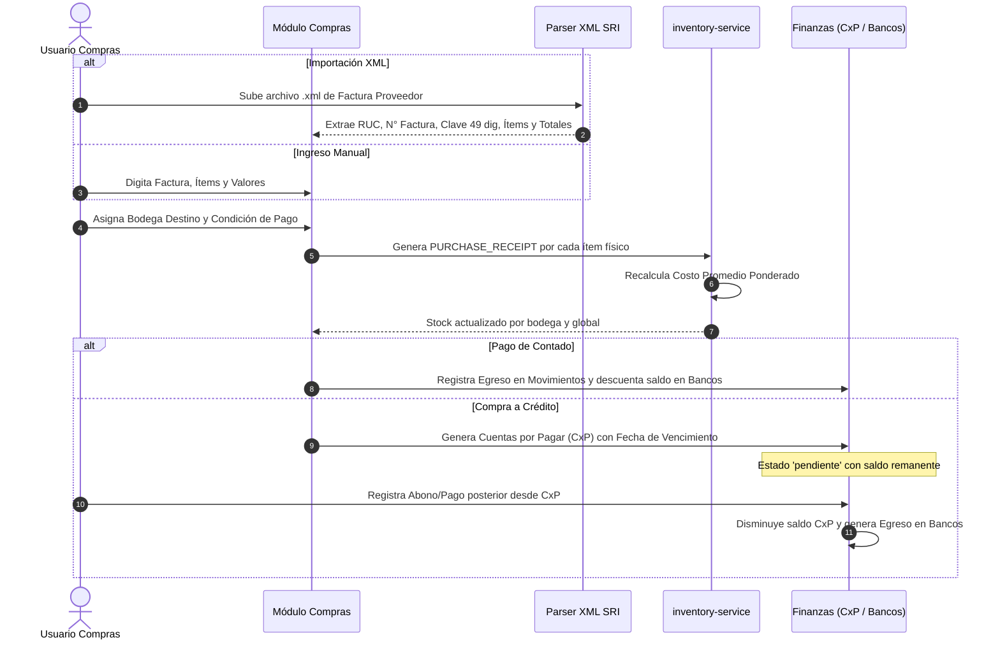

# Especificación Técnica: Módulo de Compras, Finanzas Integradas y Control de Personas & Usuarios

**Fecha:** 28 de Septiembre de 2026  
**Sistema:** INNTEL CORP ERP  
**Ruta del Archivo:** `docs/superpowers/specs/2026-09-28-compras-finanzas-personas-design.md`  
**Estado:** Propuesta Aprobada en Brainstorming  

---

## 1. Resumen Ejecutivo y Objetivos

Este documento formaliza la arquitectura del **Módulo de Compras**, la reestructuración completa del **Módulo de Finanzas** (Tesorería & Cuentas por Cobrar/Pagar) y la expansión del **Módulo de Personas** con directorio de Proveedores y **Control Avanzado de Usuarios con Matriz Granular de Permisos por Módulo y Submódulo**.

### Objetivos Clave
1. **Compras Oficiales & SRI**: Gestionar el ciclo de adquisiciones mercantiles con importación de comprobantes XML electrónicos emitidos por proveedores, notas de crédito/débito recibidas y emisión de retenciones electrónicas en la fuente e IVA.
2. **Kardex Automático**: Al ingresar productos físicos en compras, impactar inmediatamente la bodega seleccionada con el movimiento `PURCHASE_RECEIPT` y recalcular el costo promedio ponderado de inventario. En devoluciones por notas de crédito recibidas, registrar salidas `SUPPLIER_RETURN`.
3. **Finanzas y Tesorería Completa**:
   - Centralizar en `/finanzas` 5 submódulos de alta precisión: **Movimientos**, **Bancos**, **Cuentas por Cobrar (CxC)**, **Cuentas por Pagar (CxP)** y **Reportes**.
   - Garantizar trazabilidad entre compras a crédito, generación de deuda en CxP y liquidación mediante abonos bancarios o en efectivo.
4. **Directorio Unificado de Personas**:
   - Centralizar en un único módulo madre los submódulos: **Clientes**, **Proveedores** y **Usuarios / Equipo**.
5. **Control de Usuarios Avanzado (RBAC & Permisos Granulares)**:
   - Administrar los miembros del equipo de INNTEL CORP.
   - Definir roles base (Superadmin, Administrador, Finanzas/Contador, Técnico, Soporte, Consulta).
   - Permitir activar o desactivar dinámicamente el acceso individual a cada **módulo y submódulo** del ERP para cada usuario.

---

## 2. Arquitectura de Módulos y Submódulos

```
========================================================================================
                                 INNTEL CORP ERP
========================================================================================

├── [1] MÓDULO COMPRAS (/compras)
│   ├── Submódulo 1.1: Historial de Compras (Listado, filtros, detalle, RIDE/XML)
│   ├── Submódulo 1.2: Registrar Compra (Carga XML SRI / Manual, enlace a Bodegas & Kardex)
│   ├── Submódulo 1.3: Notas de Crédito Recibidas (Descuentos o Devoluciones a Kardex)
│   ├── Submódulo 1.4: Notas de Débito Recibidas (Cargos adicionales de proveedores)
│   └── Submódulo 1.5: Retenciones de Compras (Emisión comprobante electrónico SRI 49 dígitos)
│
├── [2] MÓDULO FINANZAS (/finanzas)
│   ├── Submódulo 2.1: Movimientos (Flujo cronológico de ingresos y egresos, caja general)
│   ├── Submódulo 2.2: Bancos (Cuentas bancarias de INNTEL CORP, saldos y transferencias)
│   ├── Submódulo 2.3: Cuentas por Cobrar (Cartera de clientes, morosidad y cobros)
│   ├── Submódulo 2.4: Cuentas por Pagar (Deudas a proveedores por compras, abonos y pagos)
│   └── Submódulo 2.5: Reportes (Balance de ingresos vs egresos, flujo de caja, antigüedad)
│
└── [3] MÓDULO PERSONAS (/clientes -> /personas)
    ├── Submódulo 3.1: Clientes (Abonados de internet y telecomunicaciones)
    ├── Submódulo 3.2: Proveedores (Directorio de proveedores, RUC, contactos, crédito)
    └── Submódulo 3.3: Usuarios / Equipo (Gestión de usuarios, roles y matriz de permisos)
```

---

## 3. Especificación Detallada por Módulo

### 3.1. Módulo Compras (`/compras`)

#### 1. Historial de Compras
- Tabla responsiva de facturas de proveedores registradas.
- Columnas: Fecha, N° Comprobante, Proveedor (RUC y Razón Social), Bodega de destino, Subtotal, IVA, Total, Condición (Contado / Crédito), Estado de Pago (`pagado`, `pendiente`, `abono_parcial`), Estado Inventario (`ingresado`, `no_aplica`).
- Filtros rápidos por rango de fechas, proveedor, estado y bodega.
- Acciones: Ver detalle de ítems, ver comprobante, registrar retención asociada.

#### 2. Registrar Compra
- **Modo A: Importar XML SRI del Proveedor**:
  - Zona drag-and-drop para archivo `.xml`.
  - Parser local de XML que extrae: RUC emisor, Razón Social, Dirección, N° Factura (`estab-ptoEmi-secuencial`), Clave de acceso (49 dígitos), Fecha de emisión, Ítems (código, descripción, cantidad, precio unitario, descuento), Totales (Base 15%, Base 0%, IVA, Total).
  - Emparejamiento asistido: El usuario asocia cada ítem del XML con un producto existente en el catálogo de `Inventario` (o lo crea con un clic) y selecciona la **bodega de destino**.
- **Modo B: Formulario Manual**:
  - Para notas de venta físicas o compras directas sin factura electrónica.
  - Selección de proveedor (del directorio de Proveedores), número de comprobante, fecha, bodega por defecto.
  - Tabla dinámica de ítems con autocompletado desde `inventoryProducts`.
- **Condición de Pago**:
  - Si es **Contado**: Se selecciona la cuenta bancaria / caja de origen en `Bancos`. Se marca inmediatamente como `pagado` y genera el egreso en `Finanzas -> Movimientos`.
  - Si es **Crédito**: Se define la fecha de vencimiento (`dueDate`). Se genera una obligación pendiente en `Finanzas -> Cuentas por Pagar`.
- **Impacto en Inventario (Kardex)**:
  - Para cada ítem físico, invoca `buildKardexEntry` con tipo `PURCHASE_RECEIPT`.
  - Recalcula el costo promedio ponderado: `((StockActual * CostoActual) + (QtyEntrada * CostoEntrada)) / (StockActual + QtyEntrada)`.
  - Actualiza el stock global y el stock de la bodega seleccionada (`stockByWarehouse[warehouseId]`).

#### 3. Notas de Crédito Recibidas
- Registro de comprobantes de crédito recibidos de proveedores (por devolución o bonificación).
- Si es por devolución física: reduce el stock de la bodega destino mediante movimiento de Kardex `SUPPLIER_RETURN`.
- Disminuye directamente la deuda de la compra asociada en `Cuentas por Pagar` (o genera saldo a favor).

#### 4. Notas de Débito Recibidas
- Registro de cargos adicionales emitidos por el proveedor (intereses de financiamiento, fletes, etc.).
- Incrementa el saldo adeudado de la compra en `Cuentas por Pagar`.

#### 5. Retenciones de Compras
- Generación del comprobante de Retención Electrónica emitido por INNTEL CORP hacia el proveedor.
- Cálculo de porcentajes oficiales del SRI de Ecuador:
  - Retención en la fuente de Impuesto a la Renta (ej. 1.75% bienes, 2.75% servicios, 8% honorarios, 0%).
  - Retención de IVA (ej. 30% bienes, 70% servicios, 100% liquidaciones o servicios profesionales).
- Generación de clave de acceso de 49 dígitos (módulo 11) y RIDE descargable/imprimible.

---

### 3.2. Módulo Finanzas (`/finanzas`)

#### 1. Movimientos
- Flujo cronológico unificado de ingresos y egresos de dinero.
- Métricas principales: Total Ingresos del Mes, Total Egresos del Mes, Flujo Neto Operativo, Balance Actual.
- Modal de registro rápido de egreso operativo (OPEX) o ingreso manual.
- Filtro por tipo (`ingreso` | `egreso`), cuenta bancaria, categoría y fechas.

#### 2. Bancos
- Catálogo de cuentas bancarias y cajas de INNTEL CORP:
  - Ejemplos iniciales: Banco Pichincha (Cta. Corriente), Banco Guayaquil (Cta. Ahorros), Produbanco (Cta. Corriente), Caja Chica Operativa.
- Cada cuenta muestra: Banco, Tipo de cuenta, Número, Moneda (USD), Saldo Actual, Saldo Conciliado.
- Modal para agregar cuentas bancarias y transferencias entre cuentas propias.

#### 3. Cuentas por Cobrar (CxC)
- Visualización de la cartera de clientes proveniente de facturación recurrente de telecomunicaciones y facturas SRI.
- Columnas: Cliente, N° Factura / Mensualidad, Fecha de Emisión, Vencimiento, Total Facturado, Valor Cobrado, Saldo Pendiente, Estado (`pendiente`, `cobro_parcial`, `cobrado`, `vencido`).
- Botón **"Registrar Cobro"**: modal para registrar cobranzas (abonos o totales) con cuenta bancaria destino y número de comprobante.

#### 4. Cuentas por Pagar (CxP)
- Control de deudas con proveedores originadas en compras a crédito.
- Semáforo de vencimiento:
  - 🟢 Al Día: Vence en más de 5 días.
  - 🟡 Por Vencer: Vence en menos de 5 días.
  - 🔴 Vencida: Fecha de vencimiento superada sin liquidar.
- Modal **"Registrar Pago / Abono"**:
  - Entrada de monto a pagar, fecha, cuenta bancaria origen (`Bancos`), método de pago (transferencia, cheque, efectivo), N° de transacción bancaria.
  - Actualiza el saldo pendiente de la compra. Si el saldo llega a 0, pasa a `pagado`.
  - Genera automáticamente el egreso correspondiente en `Finanzas -> Movimientos` y descuenta el saldo de la cuenta bancaria seleccionada.

#### 5. Reportes
- Resumen ejecutivo con gráficos de:
  - Comparativa Ingresos vs Egresos (últimos 6 meses).
  - Distribución de Egresos por Categoría (Proveedores, Nómina, Enlaces de Tránsito IP, Mantenimiento de Nodos, Arriendo de Torres).
  - Antigüedad de Cartera (CxC y CxP en rangos: 0-30 días, 31-60 días, 61-90 días, +90 días).
  - Botón de exportación a Excel / CSV.

---

### 3.3. Módulo Personas (`/clientes`)

Navegación por pestañas superiores o submódulos:

#### 1. Submódulo Clientes
- Gestión integral de clientes residenciales y corporativos (existente y mejorado).
- Ficha técnica 360°, contratos ARCOTEL, servicios de internet asignados, nodos, bóveda de credenciales y facturación.

#### 2. Submódulo Proveedores
- Directorio maestro de proveedores de telecomunicaciones y suministros.
- Campos:
  - `ruc`: 13 dígitos con validación ecuatoriana.
  - `razonSocial`: Razón social legal.
  - `nombreComercial`: Nombre de fantasía o marca.
  - `category`: Tipo de proveedor (`transito_ip`, `fibra_optica`, `equipos_networking`, `ferreteria_infraestructura`, `servicios_profesionales`, `arriendo_espacio_nodo`, `general`).
  - `email`, `phone`, `address`, `city`.
  - `creditDaysDefault`: Plazo comercial en días (0 para contado, 15, 30, 45, 60).
  - `bankInfo`: Banco, Tipo de cuenta, Número de cuenta, Beneficiario, Identificación.
  - `status`: `activo` | `inactivo`.
- Semillas iniciales con proveedores habituales de ISPs en Ecuador (importadores de fibra, distribuidores de ONTs Huawei/ZTE/Fiberhome, carriers de tránsito IP).

#### 3. Submódulo Usuarios / Equipo (Control Avanzado de Usuarios)
- Directorio de usuarios y colaboradores del sistema.
- Lista con avatar, nombre, correo, rol principal, departamento, fecha de último ingreso y estado (`activo` | `inactivo`).
- Botón **"Nuevo Usuario"** y acción **"Gestionar Permisos & Módulos"**:
  - **Asignación de Rol Base**:
    - `superadmin`: Acceso ilimitado a todo el ERP.
    - `admin`: Gestión general sin acceso a bóveda restringida.
    - `finanzas`: Acceso completo a Facturación, Compras y Finanzas.
    - `tecnico`: Acceso a Clientes, Red, Inventarios, Proyectos y Soporte.
    - `soporte`: Acceso a Clientes y Tickets de soporte.
    - `consulta`: Vista de solo lectura.
  - **Matriz de Permisos Granulares por Módulo y Submódulo**:
    El administrador puede activar o desactivar mediante switches/checkboxes el acceso a cada módulo y a cada submódulo específico:
    - **Compras**: `historial_compras`, `registrar_compra`, `notas_credito`, `notas_debito`, `retenciones`
    - **Finanzas**: `movimientos`, `bancos`, `cuentas_por_cobrar`, `cuentas_por_pagar`, `reportes`
    - **Personas**: `clientes`, `proveedores`, `usuarios_equipo`
    - **Facturación SRI**: `facturas`, `cotizaciones`, `notas_credito`, `retenciones`, `guias_remision`, `configuracion_sri`
    - **Inventarios**: `productos`, `bodegas`, `kardex`, `transferencias`, `ajustes`
    - **Red & Infraestructura**: `nodos`, `pools_ip`, `olt_mikrotik`
    - **Proyectos**: `tablero_kanban`, `bitacora`
    - **Soporte**: `tickets_abiertos`, `asignaciones`
    - **ARCOTEL**: `polizas`, `expedientes`
    - **Bóveda**: `credenciales_criticas`
  - **Impacto Inmediato**:
    - Si un usuario no tiene activo un módulo, este no aparece en su Sidebar ni puede acceder por URL.
    - Si no tiene activo un submódulo, la pestaña o acción queda oculta y bloqueada.

---

## 4. Modelos de Datos TypeScript

```typescript
// ==========================================
// PROVEEDORES & COMPRAS
// ==========================================

export type SupplierCategory =
  | "transito_ip"
  | "fibra_optica"
  | "equipos_networking"
  | "ferreteria_infraestructura"
  | "servicios_profesionales"
  | "arriendo_espacio_nodo"
  | "general";

export interface Supplier {
  id: string;
  ruc: string;
  razonSocial: string;
  nombreComercial?: string;
  category: SupplierCategory;
  email: string;
  phone: string;
  address: string;
  city?: string;
  creditDaysDefault: number; // 0 = contado, 15, 30, etc.
  bankName?: string;
  bankAccountType?: "ahorros" | "corriente";
  bankAccountNumber?: string;
  bankAccountOwner?: string;
  notes?: string;
  status: "activo" | "inactivo";
  createdAt: string;
  updatedAt: string;
}

export interface PurchaseItem {
  id: string;
  productId?: string;        // ID de inventoryProducts si está emparejado
  sku?: string;
  name: string;
  description?: string;
  quantity: number;
  unitCost: number;
  discount: number;
  ivaRate: number;           // 15, 0, 5
  subtotal: number;
  ivaAmount: number;
  total: number;
  warehouseId: string;       // Bodega donde ingresa la mercadería
}

export type PurchasePaymentCondition = "contado" | "credito";
export type PurchasePaymentStatus = "pagado" | "pendiente" | "abono_parcial";

export interface PurchaseInvoice {
  id: string;
  documentNumber: string;    // ej. "001-002-000012345"
  claveAcceso?: string;      // 49 dígitos si es XML SRI
  date: string;              // YYYY-MM-DD
  supplierId: string;
  supplierName: string;
  supplierRuc: string;
  items: PurchaseItem[];
  subtotal15: number;
  subtotal0: number;
  subtotal: number;
  ivaAmount: number;
  total: number;
  paymentCondition: PurchasePaymentCondition;
  paymentMethod?: string;    // si fue contado
  bankAccountId?: string;    // cuenta bancaria de donde salió el dinero si fue contado
  paymentStatus: PurchasePaymentStatus;
  paidAmount: number;
  balanceRemaining: number;
  dueDate?: string;          // fecha de vencimiento si fue a crédito
  inventoryStatus: "ingresado" | "no_aplica";
  xmlContent?: string;
  notes?: string;
  createdAt: string;
}

export interface SupplierCreditNote {
  id: string;
  purchaseInvoiceId: string;
  documentNumber: string;
  claveAcceso?: string;
  supplierId: string;
  supplierName: string;
  date: string;
  total: number;
  reason: "devolucion_mercaderia" | "descuento_bonificacion" | "correccion_precio";
  items?: {
    productId: string;
    productName: string;
    warehouseId: string;
    quantity: number;
    unitCost: number;
  }[];
  notes?: string;
  createdAt: string;
}

export interface SupplierDebitNote {
  id: string;
  purchaseInvoiceId: string;
  documentNumber: string;
  claveAcceso?: string;
  supplierId: string;
  supplierName: string;
  date: string;
  total: number;
  reason: string;
  createdAt: string;
}

export interface PurchaseWithholding {
  id: string;
  purchaseInvoiceId: string;
  documentNumber: string;    // ej. "001-001-000000012"
  claveAcceso: string;       // 49 dígitos SRI
  supplierId: string;
  supplierName: string;
  supplierRuc: string;
  date: string;
  rentaBase: number;
  rentaPercentage: number;
  rentaAmount: number;
  ivaBase: number;
  ivaPercentage: number;
  ivaAmount: number;
  totalWithheld: number;
  createdAt: string;
}

// ==========================================
// FINANZAS: BANCOS & CUENTAS POR PAGAR / COBRAR
// ==========================================

export interface BankAccount {
  id: string;
  bankName: string;          // ej. "Banco Pichincha", "Banco Guayaquil", "Caja Chica"
  accountType: "corriente" | "ahorros" | "caja_efectivo";
  accountNumber: string;
  currency: "USD";
  initialBalance: number;
  currentBalance: number;
  status: "activa" | "inactiva";
}

export interface FinancialMovement {
  id: string;
  type: "ingreso" | "egreso";
  date: string;
  amount: number;
  category: string;          // "compra_proveedor", "cobro_cliente", "opex_servicios", etc.
  description: string;
  bankAccountId: string;
  bankAccountName: string;
  paymentMethod: "transferencia" | "cheque" | "efectivo" | "tarjeta";
  referenceNumber?: string;
  relatedEntityId?: string;  // ID de la compra, cobro o gasto
  createdAt: string;
}

export interface SupplierPaymentRecord {
  id: string;
  purchaseInvoiceId: string;
  supplierId: string;
  supplierName: string;
  date: string;
  amount: number;
  bankAccountId: string;
  bankAccountName: string;
  paymentMethod: "transferencia" | "cheque" | "efectivo";
  referenceNumber: string;
  notes?: string;
  registeredBy: string;
  createdAt: string;
}

// ==========================================
// CONTROL DE USUARIOS & PERMISOS GRANULARES
// ==========================================

export interface UserModulePermissions {
  // Módulos con acceso booleano y lista de submódulos permitidos
  compras: {
    enabled: boolean;
    submodules: {
      historial_compras: boolean;
      registrar_compra: boolean;
      notas_credito: boolean;
      notas_debito: boolean;
      retenciones: boolean;
    };
  };
  finanzas: {
    enabled: boolean;
    submodules: {
      movimientos: boolean;
      bancos: boolean;
      cuentas_por_cobrar: boolean;
      cuentas_por_pagar: boolean;
      reportes: boolean;
    };
  };
  personas: {
    enabled: boolean;
    submodules: {
      clientes: boolean;
      proveedores: boolean;
      usuarios_equipo: boolean;
    };
  };
  facturacion: {
    enabled: boolean;
    submodules: {
      facturas: boolean;
      cotizaciones: boolean;
      notas_credito: boolean;
      retenciones: boolean;
      guias_remision: boolean;
      configuracion_sri: boolean;
    };
  };
  inventarios: {
    enabled: boolean;
    submodules: {
      productos: boolean;
      bodegas: boolean;
      kardex: boolean;
      transferencias: boolean;
      ajustes: boolean;
    };
  };
  red: {
    enabled: boolean;
    submodules: {
      nodos: boolean;
      pools_ip: boolean;
    };
  };
  proyectos: {
    enabled: boolean;
  };
  tickets: {
    enabled: boolean;
  };
  arcotel: {
    enabled: boolean;
  };
  boveda: {
    enabled: boolean;
  };
}
```

---

## 5. Integración Kardex y Finanzas



---

## 6. Validación, Manejo de Errores y Seguridad

1. **Validación de RUC de Proveedor**: Debe cumplir el formato oficial de Ecuador (13 dígitos, terminando en 001 y algoritmo de tercer dígito según persona natural o jurídica).
2. **Duplicidad de Facturas**: No se permite registrar una compra con el mismo RUC de proveedor y el mismo número de comprobante o clave de acceso SRI.
3. **Consistencia en Kardex**: En productos que no controlan stock o son servicios, no se generan movimientos de Kardex. Para productos físicos, la bodega debe existir en el catálogo.
4. **Validación de Cuentas por Pagar**: Los abonos registrados no pueden superar el saldo pendiente de la compra.
5. **Control de Acceso (RBAC)**: Si un usuario intenta acceder a una ruta o submódulo no autorizado, el sistema redirige automáticamente al Dashboard con una notificación de permiso denegado.

---

## 7. Plan de Verificación y Pruebas

1. **Parser XML SRI**:
   - Probar con XMLs reales de compras SRI de Ecuador (ej. CNT, distribuidores de tecnología) validando que extraiga correctamente la clave de 49 dígitos, RUC, totales y líneas de productos.
2. **Kardex y Promedio Ponderado**:
   - Caso de prueba: Producto con Stock 10 a $5.00 ($50). Se compran 10 a $7.00 ($70). El nuevo stock debe ser 20 y el nuevo costo promedio ponderado debe ser exactamente $6.00.
3. **Cuentas por Pagar y Abonos**:
   - Registrar compra a crédito por $500.
   - Abonar $200 desde Banco Pichincha: verificar que el saldo pendiente quede en $300 y que en `Finanzas -> Movimientos` aparezca el egreso por $200.
4. **Matriz de Permisos**:
   - Crear un usuario con rol `tecnico` desmarcando el módulo `finanzas` y el submódulo `compras.retenciones`.
   - Iniciar sesión y comprobar que el Sidebar oculte Finanzas y que en Compras no aparezca la pestaña Retenciones.
5. **Compilación y Build**:
   - Ejecutar `tsc --noEmit` y `npm run build` garantizando 0 errores de TypeScript y 0 warnings en App Router.
